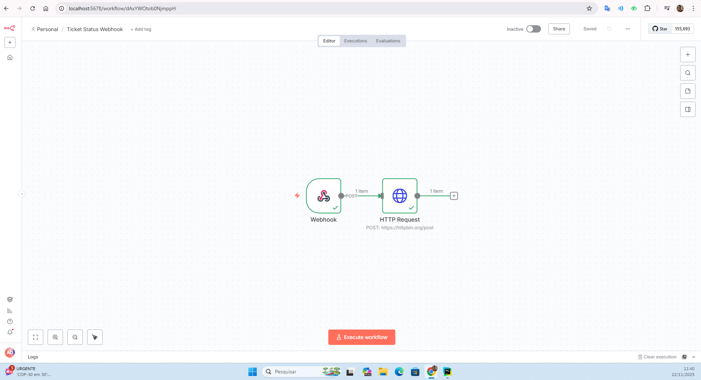
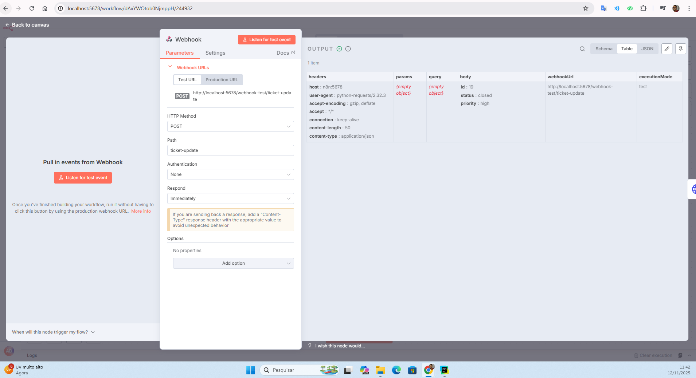

# Mini Inbox – Teste Técnico Stalse

Sistema simplificado de gerenciamento de tickets, desenvolvido como parte do teste técnico da **Stalse**.

O projeto é composto por:

- Backend em **FastAPI**
- Frontend em **Next.js (App Router)**
- ETL em **Python + Pandas**
- Automação com **n8n**
- Orquestração com **Docker**

---

## Pré-requisito

- **Docker** instalado (Docker Desktop ou Docker Engine)

Nenhuma outra instalação é necessária.

Para download do docker, acesse o site oficial: [Docker.com](https://www.docker.com/)

---

## Como executar o projeto

No diretório **raiz** do projeto, execute:

```bash
docker compose up --build
```
Os serviços subirão automaticamente:

| Serviço   | Porta | URL |
|-----------|-------|-----|
| Frontend  | 3000  | [http://localhost:3000](http://localhost:3000) |
| Backend   | 8000  | [http://localhost:8000](http://localhost:8000) |
| n8n       | 5678  | [http://localhost:5678](http://localhost:5678) |

## Frontend (Next.js)

### Rotas principais

---

### **`/tickets`**

Lista todos os tickets cadastrados.

Funcionalidades:

- Busca por texto simples
- Exibe os campos:
  - `created_at`
  - `customer_name`
  - `channel`
  - `subject`
  - `status`
  - `priority`

---

### **`/tickets/[id]`**

Exibe detalhes de um ticket específico(clique em cima do ticket).

Permite alterar:

- `status`
- `priority`

Aciona webhook quando:

- `status = closed`
- `priority = high`

Nesse caso, um evento é enviado automaticamente ao **n8n**.

---

### **`/dashboard`**

Consome os dados retornados por **GET `/metrics`** no backend. *Dataset do kaggle*: [Technical Support Dataset](https://www.kaggle.com/datasets/suvroo/technical-support-dataset).

Exibe:

- Total de tickets
- Tickets por status
- Tickets por prioridade
- Tickets por canal
- Tickets por dia
- Tickets por tópico

## Backend (FastAPI)

O backend é responsável por:

- Gerenciar tickets(GET e UPDATE)
- Ler as métricas geradas pelo ETL
- Notificar o **n8n** quando ocorrerem eventos relevantes

---

### Banco de dados

- Utiliza **SQLite** (arquivo `db.sqlite`)
- Carrega um seed inicial de aproximadamente **20 tickets** a partir de um arquivo JSON

---

## Rotas da API

---

### **GET `/tickets`**

Retorna todos os tickets cadastrados.

**Exemplo de resposta:**

```json
[
  {
    "id": 1,
    "customer_name": "John Doe",
    "subject": "Payment issue",
    "status": "open",
    "priority": "low",
    "channel": "email",
    "created_at": "2024-01-10T10:30:00"
  }
]
```

### **PATCH `/tickets/{id}`**

Atualiza o status ou a priority de um ticket.

**Exemplo de requisição:**

```json
[
  {
  "status": "closed",
  "priority": "high"
}
]
```

Comportamento especial

Se o ticket for atualizado para:

status = "closed", ou

priority = "high"

 O backend envia automaticamente um POST para o webhook configurado no n8n.
 
### **GET `/metrics`**

Retorna as métricas processadas pelo ETL a partir do dataset do Kaggle.

o backend lê o arquivo: data/processed/`metrics.json`

**Exemplo de resposta:**

```json
{
  "total_tickets": 120,
  "tickets_by_day": {
    "2024-01-10": 12,
    "2024-01-11": 19
  },
  "tickets_by_topic": {
    "Billing": 30,
    "Technical Issue": 50
  },
  "tickets_by_priority": {
    "High": 18,
    "Medium": 52,
    "Low": 50
  },
  "tickets_by_channel": {
    "Email": 40,
    "Chat": 60,
    "Phone": 20
  },
  "tickets_by_status": {
    "Open": 80,
    "Closed": 40
  }
}
```

## ETL (Pandas + Dataset do Kaggle)

O processo de ETL é responsável por gerar o arquivo de métricas consumido pelo backend.  
Ele lê o dataset bruto, aplica transformações com Pandas e salva o resultado em um arquivo JSON.

O script principal está localizado em: `data/generate_metrics.py`

Se quiser gerar novamente o arquivo metrics.json:

1. Acesse o container do backend: ``docker exec -it backend bash``
2. Execute oscript ETL: ``python data/generate_metrics.py``
3. O arquivo será atualizado em: ``data/processed/metrics.json``

## Automação n8n

1. Acesse o painel do n8n: [Painel do N8N](http://localhost:5678)
2. Importe o arquivo: ``n8n/workflow.json``
3. Execute o workflow
4. Altere o status de um ticket para ``close`` ou priority para ``high``.
5. O evento será disparado




Obrigado.